# ♒Detecting River Water Quality 


<p align='center'>
  
</p>
<br/>

## Contents
- [Overview](#overview) 
- [Features](#features) 
- [Hardware Components](#hardware-components) 
- [Set-up](#set-up) 
- [Usage](#usage)
- [Thanks](#Thanks) 
- [License](#license) 
- [Contact](#contact)


## Overview
<p align='center'>
  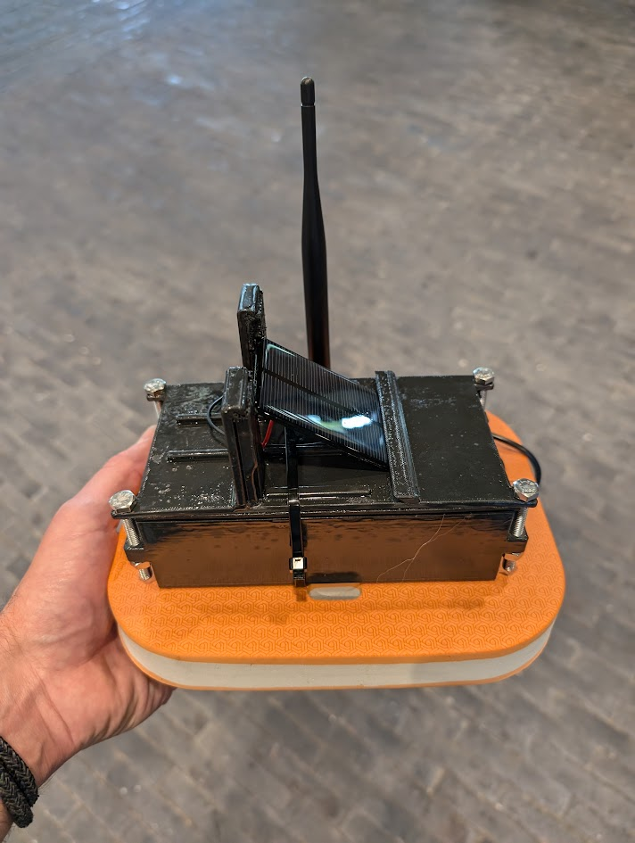
 </p>
This project created an IoT device that monitors river water quality in real-time. It detects temperature, electrical conductivity (EC) and the colour properties of water. It is an in-situ autonomous device that harvests solar energy and stores it in recycled vape batteries. The MCU is an Arduino MKR 1310 which sends the data over LoRa. The aim is to allow a user to remotely understand the changing water conditions to identify potential pollution events.
This project formed part of UCL Connected Environments MSc which concluded with an exhibition. This git also includes the exhibit details.

<p align='center'>
  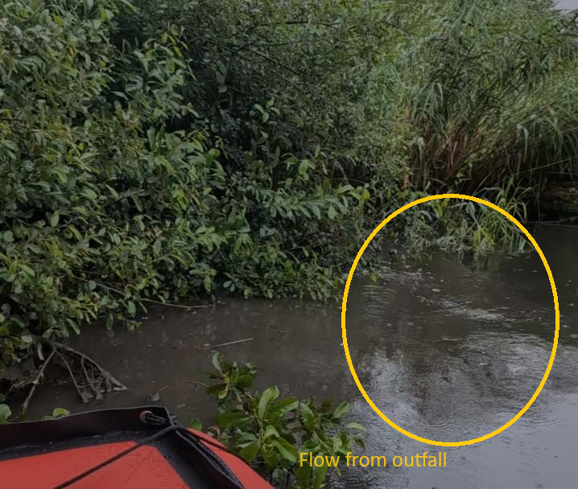
  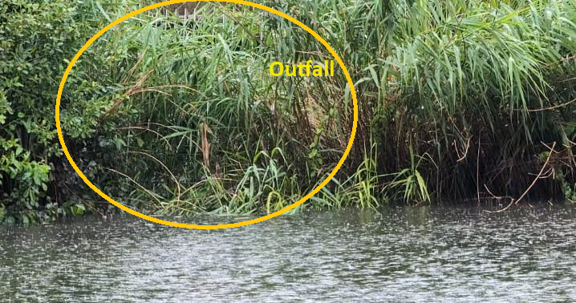
  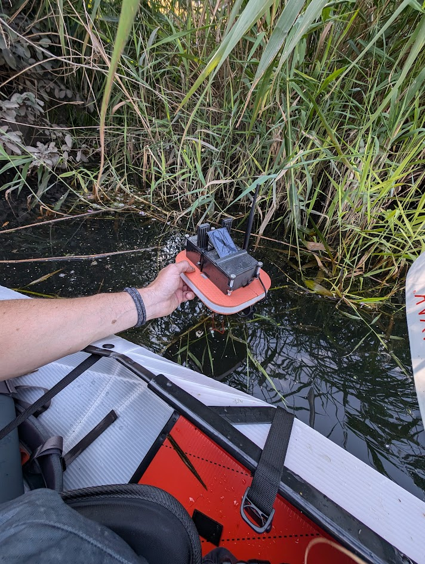
 
 </p>
 
## Features
- A custom 4-pole, graphite EC sensor
- Use of a TCS34725 with in external LED through optical fibre
- A DS18B20 temperature sensor
- LoRaWAN data transfer using Arduino MKR 1310
- Powered by a solar cell and upcycled vape batteries!


## Hardware Components 
- **Temperature Sensor** DS18B20
- **TCS34725 Colour Sensor**: [Learn more](https://www.waveshare.com/wiki/TCS34725_Color_Sensor) 
- **Custom Electrical Conductivity Sensor** inspired by the excellent Cave Pearl Project (https://thecavepearlproject.org/2017/08/12/measuring-electrical-conductivity-with-an-arduino-part1-overview/)
- **Arduino MKR1310 MCU** 
- **Solar Panel and Recycled Vape Batteries**


## Set-up
### Enclosure
The enclosure for this device was 3D printed with PLA and coated in an eco-friendly epoxy to waterproof it (tip: mixed results with this approach so thoroughly test how waterproof your final enclosure is). The files are in the *FusionFiles* directory. The float designs are included BUT the prototype deployed using these sank. The last version was deployed using a child’s kickboard as its float, which worked very well.

<p align='center'>
 The issues causes by not being waterproof can be seen below!

</p>
<p align='center'>
  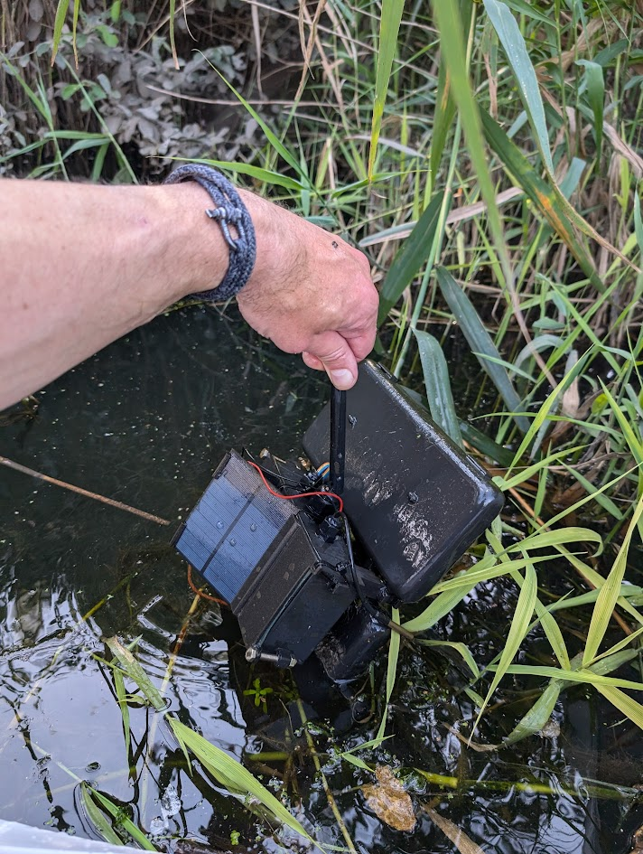
  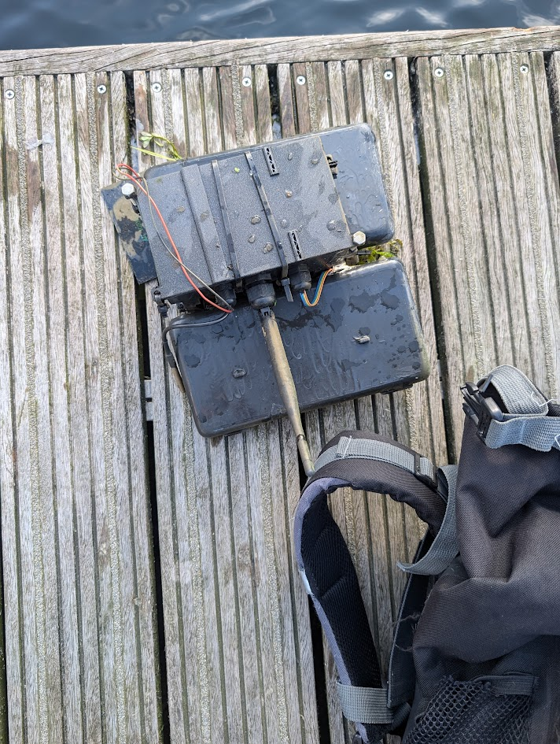
 </p>
 
### Sensors
#### Electrical Conductivity (EC)
The EC sensor uses a 4-pole design to reduce electrolysis and increase the accuracy of the sensor. Graphite was used for electrodes for its high conductivity and resistance to electrolysis. The prototypes used 2mm 8B graphite to maximise the conductivity of the graphite but, due to its softness, this is difficult to work with. A conductive glue was used to attach the electrode to the wire.
The current oscillates from the two outer poles, with the two inner poles measuring the voltage. A third voltage measurement is taken across one of the resistors connected to the outer poles. 
<p align='center'>
   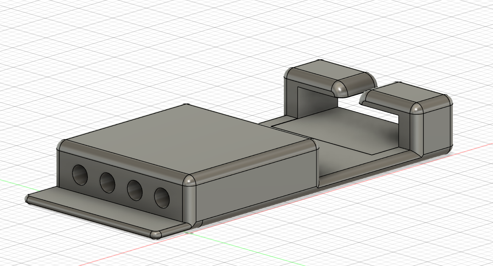
 
   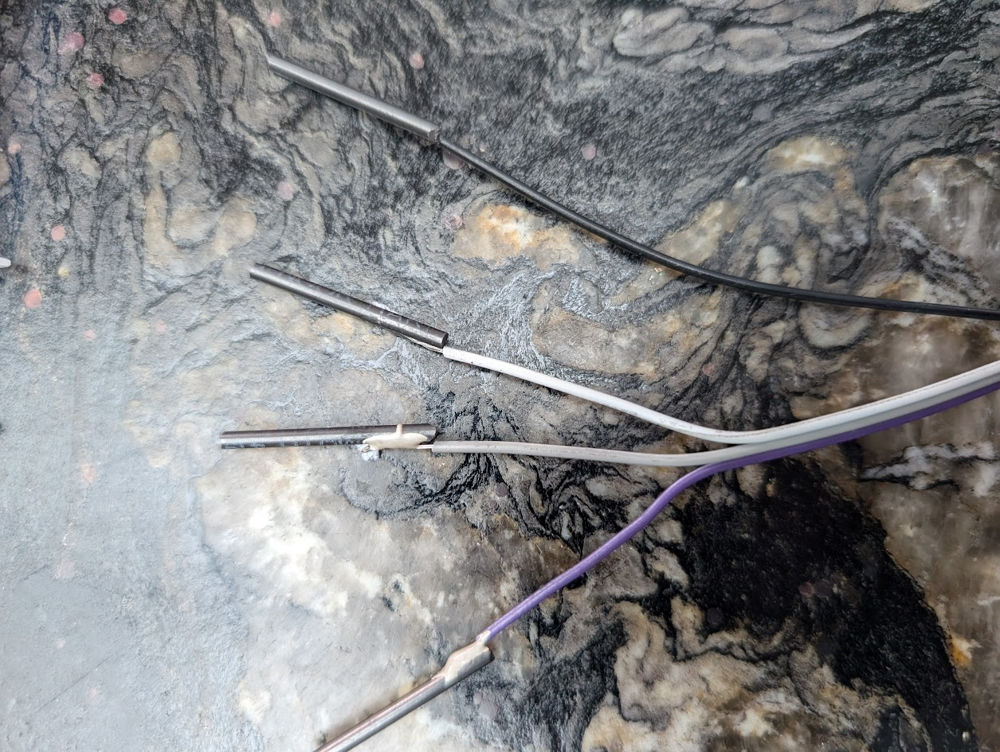
 </p>

#### TCS34725
To detect the colour of the water, light was emitted from a white LED, transmitted through the water and detected by the TCS34725. The sensor is keep away from the water by using optical fibre to transfer the light into and out of the water. An early version made use of the sensor’s onboard LED using backscattered light for colour detection but the results were poor which led to the latest design where light source is directed at the sensor.
<p align='center'>
   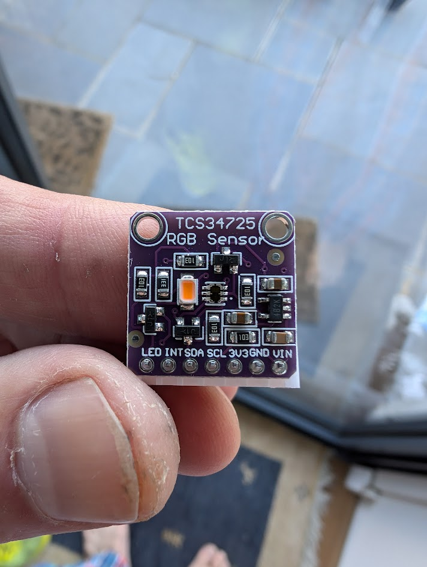
   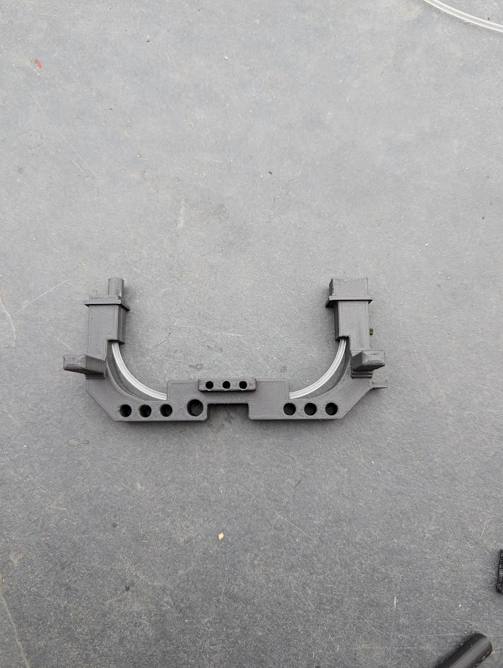
 </p>


#### DS18B20
The temperature sensor had no modifications and has the standard 4.7k ohm resistor setup. https://www.researchgate.net/figure/Design-of-Ds1820-Temperature-Sensor_fig3_260944398
#### Circuit
Below are the circuit diagrams. Through testing 510 ohm resistors were found to give the most sensitive results for pure water to sea water salinity levels.

A custom PCB was used for the final build. Files are in the *FusionFiles/PCB* folder. The resistor component had a short in the protoype. That is corrected in these files. The schematic is correct but make sure to double check the PCB if this to be used.

<p align='center'>
  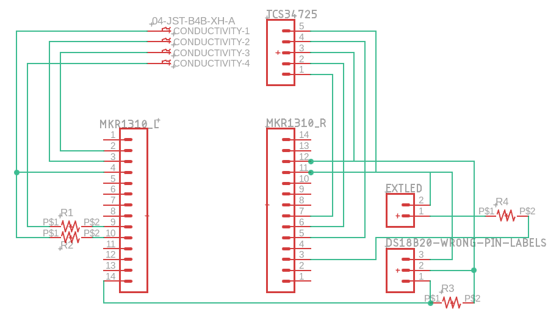
  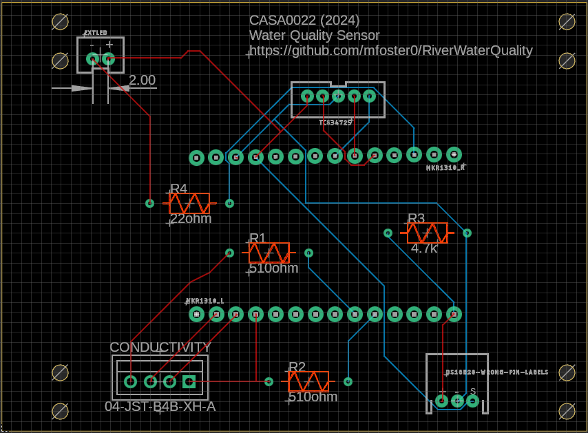
  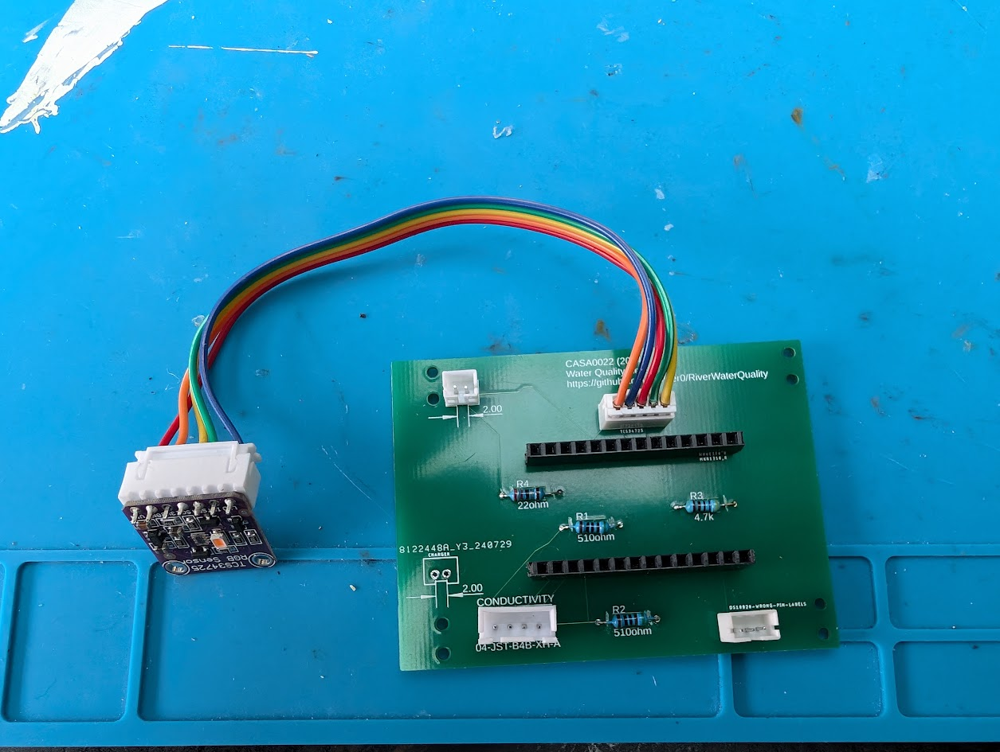
 </p>

### Code
*Prod_RiverWaterQuality* holds the Arduino code for the final version. Multiple boards and sensors were tested before arriving at this version. Some of the code for those is stored in the *InitalScripts* directory.  

The read of the voltages values are taken in the loop with the pin outputs alternating between HIGH and LOW to get the oscillating current.
```c++
//function to get conductivity values
//to the code takes multiple readings
//the highest and lowest values are dropped to help reduce the opportunity for erroneous values to be included
//the central values are then averaged 
void processConductivity(){
  // Generate oscillating current and read voltages
  std::vector<int> readings1;
  std::vector<int> readings2;
  std::vector<int> resistorReadings;
  
  unsigned long startTime = millis();
  int sampleCount = 0;

  //loop for specified time taking multiple readings
  while (millis() - startTime < SAMPLE_DELAY) {
    digitalWrite(OUTER_ELECTRODE1, HIGH);
    digitalWrite(OUTER_ELECTRODE2, LOW);
    delayMicroseconds(500000 / OSCILLATION_FREQUENCY);
    
    readings1.push_back(analogRead(INNER_ELECTRODE1));
    readings2.push_back(analogRead(INNER_ELECTRODE2));
    resistorReadings.push_back(analogRead(RESISTOR_READ));
    sampleCount++;
    
    digitalWrite(OUTER_ELECTRODE1, LOW);
    digitalWrite(OUTER_ELECTRODE2, HIGH);
    delayMicroseconds(500000 / OSCILLATION_FREQUENCY);
    
    readings1.push_back(analogRead(INNER_ELECTRODE1));
    readings2.push_back(analogRead(INNER_ELECTRODE2));
    resistorReadings.push_back(analogRead(RESISTOR_READ));
    sampleCount++;
  }
  
  //process the arrays, dropping highest and lowest values before averaging
  float avgVoltage1 = trimAndAverageReadings(readings1, sampleCount);
  float avgVoltage2 = trimAndAverageReadings(readings2, sampleCount);
  float avgResistorVoltage = trimAndAverageReadings(resistorReadings, sampleCount);
  
  //read temperature
  sensors.requestTemperatures(); // get temperature
  float temperature = sensors.getTempCByIndex(0); // Get temperature in Celsius
  Temperature = (uint16_t)(temperature * 100.0);
  Serial.print("temperature: ");
  Serial.println(temperature,3);
  Serial.println(Temperature);

  //convert to voltages
  float voltage1 = (avgVoltage1 / UPPER_BOUND) * BOARD_VOLTAGE;
  float voltage2 = (avgVoltage2 / UPPER_BOUND) * BOARD_VOLTAGE;
  float resistorVoltage = (avgResistorVoltage / UPPER_BOUND) * BOARD_VOLTAGE;

  // Calc voltage drop in solution
  float solutionVoltage = voltage2 - voltage1;

  // Calc resistance of solution
  float resistance = resistorVoltage / (solutionVoltage / RESISTOR_VALUE); 

  // Calc raw conductivity - any temperature compensation to be done off device
  float rawConductivity = 1.0 / resistance; 

  Conductivity = (uint16_t)(rawConductivity * 100);
  Serial.println(Conductivity);

```
The reads do get anomalies. To counter this many reads are taken with just the central values being used and the highest and lowest values dropped.  
```c++
//drop highest and lowest n% of values to reduce noise
float trimAndAverageReadings(std::vector<int>& readings, int numReadings) {
    if (readings.empty() || numReadings < 3) {
        return 0.0f;  // return 0 if the list is empty or numReadings is too small
    }

    //sort the vector
    std::sort(readings.begin(), readings.end());

    // calc number of elements to trim
    int trimCount = std::round(numReadings * 0.2);  // 20% from top and bottom
    
    // don't trim more than half the values
    trimCount = std::min(trimCount, ((int)readings.size() / 2) - 1);

    // sum up
    float sum = 0;
    for (int i = trimCount; i < readings.size() - trimCount; ++i) {
        sum += readings[i];
    }

    // retrun average
    int remainingElements = readings.size() - (2 * trimCount); //2x - 1 at each end
    return sum / remainingElements;
}
```
The device sleeps for 10 minutes between reads (*LowPower.deepSleep(600000);*). This ensures that it conserves power and stays well within The Things Network fair use conditions. When the device wakes it reads the current sensor values and sends them using LoRa.
```c++
//from setup
…
  //startup LoRa modem instance set regional band 
  if (!modem.begin(EU868)) {
    Serial.println("Failed to start module");
  }

  Serial.print("Your device EUI is: ");
  Serial.println(modem.deviceEUI());

  int connected = modem.joinOTAA(appEui, appKey);
  if (!connected) {
    Serial.println("Unable to connect");
  }
…

//send data over LoRaWAN
void sendLora(){
    // Split readings (16 bits) into 2 bytes of 8
  int payloadLen = 10;
  Serial.println(payloadLen);
  
  byte payload[payloadLen];
  payload[0] = highByte(Temperature);
  payload[1] = lowByte(Temperature);
  payload[2] = highByte(Conductivity);
  payload[3] = lowByte(Conductivity);
  
  payload[4] = highByte(Red);
  payload[5] = lowByte(Red);
  payload[6] = highByte(Green);
  payload[7] = lowByte(Green);
  payload[8] = highByte(Blue);
  payload[9] = lowByte(Blue);

  modem.beginPacket();
  modem.write(payload, sizeof(payload));
  int err = modem.endPacket(true);
  if (err > 0) {
    Serial.println("Message sent correctly");
  } else {
    Serial.println("Error sending message");
  }
}

```

## Thanks
 - Dr Izzy Bishop (UCL) for input and help deploying the devices
 - Lewis Elmes (Environment Agency) for approving the deployments

## License
MIT License

Copyright (c) 2024 mfoster0

Permission is hereby granted, free of charge, to any person obtaining a copy
of this software and associated documentation files (the "Software"), to deal
in the Software without restriction, including without limitation the rights
to use, copy, modify, merge, publish, distribute, sublicense, and/or sell
copies of the Software, and to permit persons to whom the Software is
furnished to do so, subject to the following conditions:

The above copyright notice and this permission notice shall be included in all
copies or substantial portions of the Software.

THE SOFTWARE IS PROVIDED "AS IS", WITHOUT WARRANTY OF ANY KIND, EXPRESS OR
IMPLIED, INCLUDING BUT NOT LIMITED TO THE WARRANTIES OF MERCHANTABILITY,
FITNESS FOR A PARTICULAR PURPOSE AND NONINFRINGEMENT. IN NO EVENT SHALL THE
AUTHORS OR COPYRIGHT HOLDERS BE LIABLE FOR ANY CLAIM, DAMAGES OR OTHER
LIABILITY, WHETHER IN AN ACTION OF CONTRACT, TORT OR OTHERWISE, ARISING FROM,
OUT OF OR IN CONNECTION WITH THE SOFTWARE OR THE USE OR OTHER DEALINGS IN THE
SOFTWARE.

## Contact
Please let me know if you find errors in here or if you taking the project further.
ucfnamm@ucl.ac.uk

